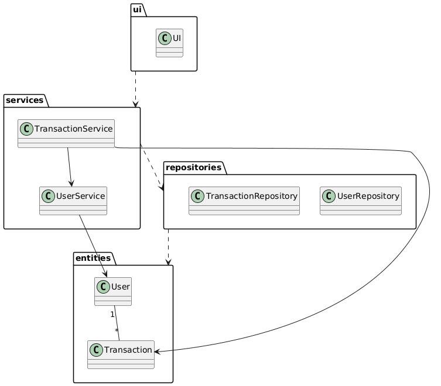
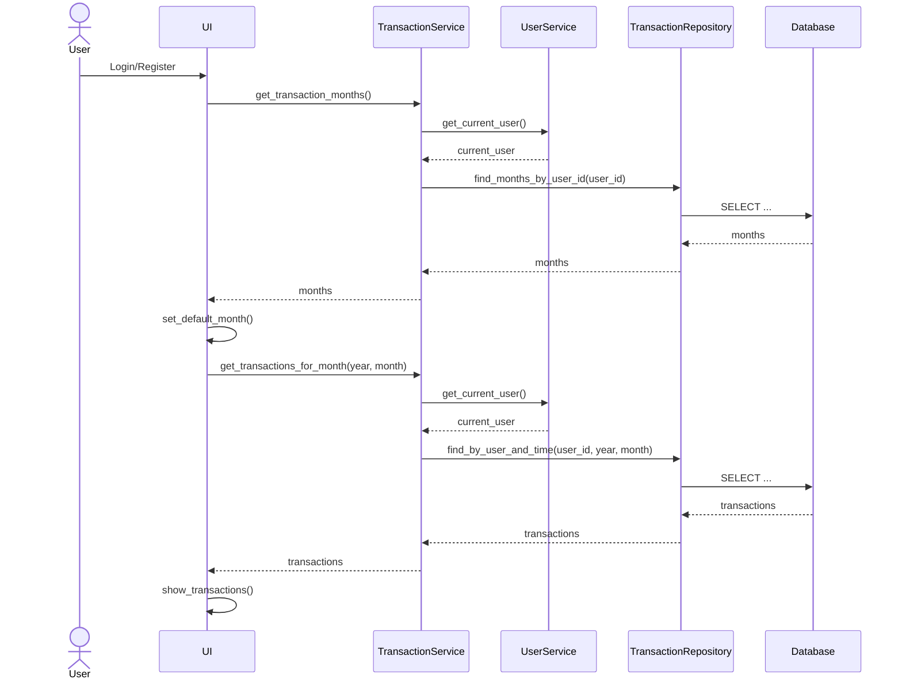

# Arkkitehtuuri

## Pakkausrakenne

Ohjelman rakenne noudattelee kolmitasoista kerrosarkkitehtuuria, ja koodin pakkausrakenne on seuraava:

Pakkaus `ui` sisältää sovelluksen käyttöliittymän, `services` sovelluslogiikan, `repositories` tietokantaoperaatiot ja `entities` sovelluksen käyttämät tietokohteet.

## Käyttöliittymä

Käyttöliittymä sisältää tällä hetkellä erilliset näkymät seuraaville toiminnoille:

- Aloitusnäkymä sovelluksen käynnistyessä
- Kirjautuminen
- Rekisteröityminen
- Päänäkymä
- Uuden tapahtuman luominen

Jokainen näkymä on toteutettu omaan luokkaansa ja niiden näyttämisestä vastaa [UI](../src/ui/ui.py)-luokka. 

Kun käyttäjä kirjautuu sisään tai lisää uuden tapahtuman, päivittää käyttöliittymä päänäkymän näyttämään valitun kuukauden tapahtumat uudelleen. Päänäkymässä käyttäjä voi valita tarkasteltavan kuukauden pudotusvalikosta, minkä perusteella näkymä hakee ja renderöi kyseiseen kuukauteen kuuluvat tapahtumat.

## Tietokanta

Tietojen tallennuksesta SQLite-tietokantaan vastaa pakkauksen `repositories` luokat `UserRepository` ja `TransactionRepository`. Luokkien toteutusta on mahdollista muuttaa, jos tallennustapaa halutaan myöhemmin muuttaa. 

Sovellus käyttää tietokantatiedoston sijainnin määrittelyyn juureen sijoitettua konfiguraatiota. Tietokantatiedosto luetaan `.env` tiedostosta ympäristömuuttujien asettamiseksi, tai sen puuttuessa käytetään oletusarvoista tietokannan nimeä. Testeissä käytetään erillistä testitietokantaa. 

Tietokanta alustetaan tiedostossa `init_db.py`. Tietokanta sisältää taulut `users` ja `transactions`.

## Päätoiminnallisuudet

Käyttäjän kirjautuessa tai rekisteröityessä sovellukseen, päätyy hän ohjelman pääsivulle, jossa tapahtumat näytetään seuraavasti:

