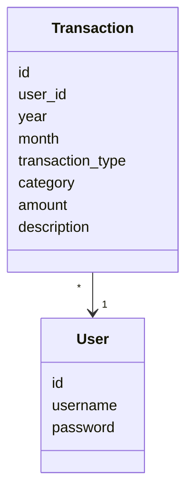
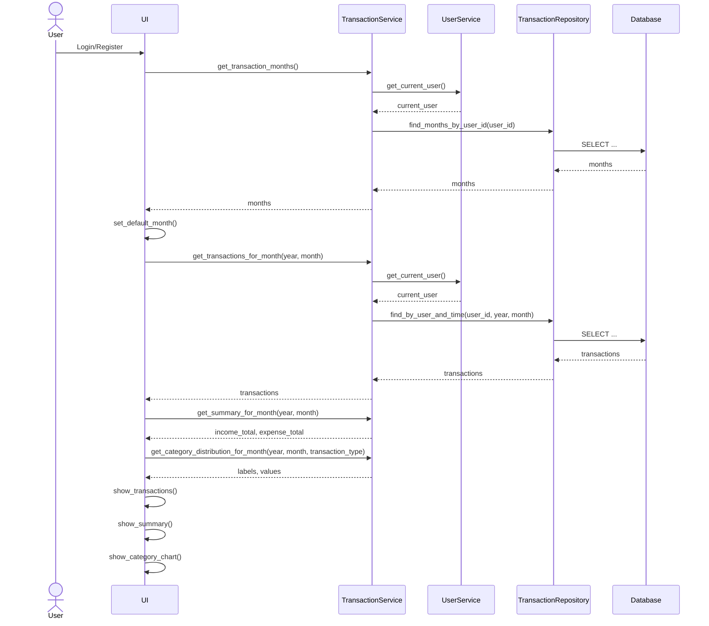

# Arkkitehtuuri

## Pakkausrakenne

Ohjelman rakenne noudattelee kolmitasoista kerrosarkkitehtuuria, ja koodin pakkausrakenne on seuraava:

Pakkaus `ui` sisältää sovelluksen käyttöliittymän, `services` sovelluslogiikan, `repositories` tietokantaoperaatiot ja `entities` sovelluksen käyttämät tietokohteet.

## Käyttöliittymä

Käyttöliittymä sisältää tällä hetkellä erilliset näkymät seuraaville toiminnoille:

- Aloitusnäkymä sovelluksen käynnistyessä
- Kirjautuminen
- Rekisteröityminen
- Päänäkymä
- Uuden tapahtuman luominen/Luodun tapahtuman muokkaaminen

Jokainen näkymä on toteutettu omaan luokkaansa ja niiden näyttämisestä vastaa [UI](../src/ui/ui.py)-luokka. 

Kun käyttäjä kirjautuu sisään tai lisää uuden tapahtuman, päivittää käyttöliittymä päänäkymän näyttämään valitun kuukauden tapahtumat uudelleen. Päänäkymässä käyttäjä voi valita tarkasteltavan kuukauden pudotusvalikosta, minkä perusteella näkymä hakee ja renderöi kyseiseen kuukauteen kuuluvat tapahtumat.

## Sovelluslogiikka

Sovelluksen tietokohteet muodostavat luokat `User` ja `Transaction`, jotka kuvaavat sovelluksen käyttäjiä ja käyttäjien tallentamia tapahtumia:

Sovelluslogiikasta vastaavat luokat `UserService` ja `TransactionService`.

## Tietokanta

Tietojen tallennuksesta SQLite-tietokantaan vastaa pakkauksen `repositories` luokat `UserRepository` ja `TransactionRepository`. Luokkien toteutusta on mahdollista muuttaa, jos tallennustapaa halutaan myöhemmin muuttaa. 

Sovellus käyttää tietokantatiedoston sijainnin määrittelyyn juureen sijoitettua konfiguraatiota. Tietokantatiedosto luetaan `.env` tiedostosta ympäristömuuttujien asettamiseksi, tai sen puuttuessa käytetään oletusarvoista tietokannan nimeä. Testeissä käytetään erillistä testitietokantaa. 

Tietokanta alustetaan tiedostossa `init_db.py`. Tietokanta sisältää taulut `users` ja `transactions`.

## Päätoiminnallisuudet

Käyttäjän kirjautuessa tai rekisteröityessä sovellukseen, päätyy hän ohjelman pääsivulle, jossa tapahtumat näytetään seuraavasti:

Sovellukseen käyttöliittymä siirtyy päänäkymään, jossa näytetään käyttäjän tapahtumat valitulta kuukaudelta. Ensin käyttöliittymä pyytää sovelluslogiikalta kaikki ne `(vuosi, kuukausi)`-parit, joilta käyttäjällä on tallennettuja tapahtumia. `TransactionService` hakee kirjautuneen käyttäjän `UserService`:n avulla ja pyytää tämän jälkeen `TransactionRepository`:a hakemaan käyttäjän tapahtumakuukaudet tietokannasta. Kun käyttöliittymä on saanut saatavilla olevat kuukaudet, se valitsee oletuksena näytettävän kuukauden. Tämän jälkeen käyttöliittymä pyytää sovelluslogiikalta valitun kuukauden tapahtumat. Kaikki käyttäjälle ja valitulle kuukaudelle kuuluvat tapahtumat haetaan `TransactionService`:stä, joka pyytää `TransactionRepository`:a hakemaan tiedot tietokannasta.

Kun tapahtumat on palautettu käyttöliittymään, päänäkymä renderöi ne käyttäjälle näkyviin. Tapahtumien näyttämisen lisäksi päänäkymä muodostaa samalle kuukaudelle myös yhteenvedon tuloista ja menoista sekä kategoriakohtaisen kaavion valitun tapahtumatyypin perusteella.
