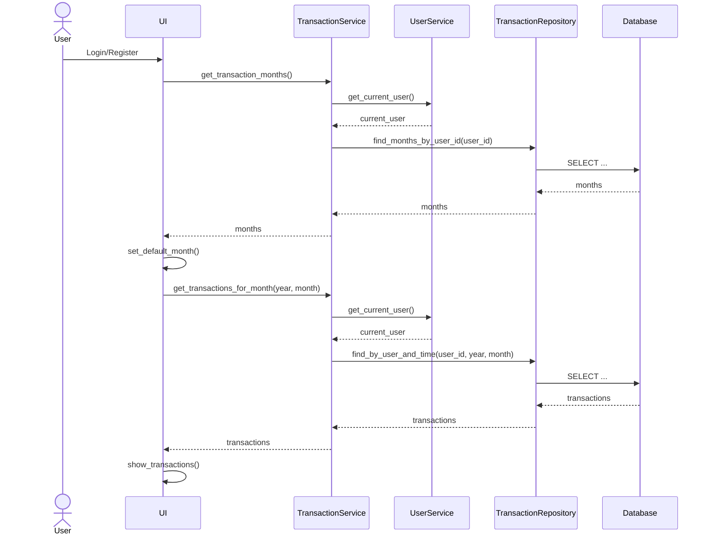

# Arkkitehtuuri

## Pakkausrakenne

## Sekvenssikaavio

Käyttäjän kirjautuessa tai rekisteröityessä sovellukseen, päätyy hän ohjelman pääsivulle, jossa tapahtumat näytetään seuraavasti:

```mermaid
sequenceDiagram
    actor User
    participant UI
    participant TransactionService
    participant UserService
    participant TransactionRepository
    participant Database

    User->>UI: Login/Register
    UI->>TransactionService: get_transaction_months()
    TransactionService->>UserService: get_current_user()
    UserService-->>TransactionService: current_user
    TransactionService->>TransactionRepository: find_months_by_user_id(user_id)
    TransactionRepository->>Database: SELECT ...
    Database-->>TransactionRepository: months
    TransactionRepository-->>TransactionService: months
    TransactionService-->>UI: months

    UI->>UI: set_default_month()

    UI->>TransactionService: get_transactions_for_month(year, month)
    TransactionService->>UserService: get_current_user()
    UserService-->>TransactionService: current_user
    TransactionService->>TransactionRepository: find_by_user_and_time(user_id, year, month)
    TransactionRepository->>Database: SELECT  ...
    Database-->>TransactionRepository: transactions
    TransactionRepository-->>TransactionService: transactions
    TransactionService-->>UI: transactions

    UI->>UI: show_transactions()
```
