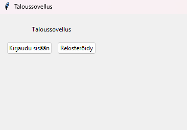
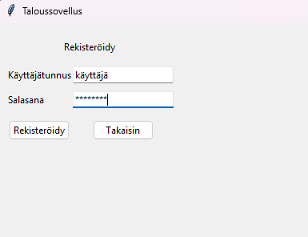
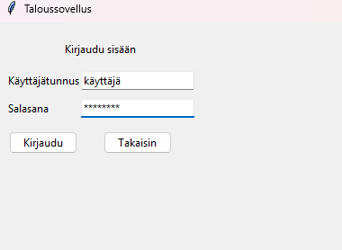
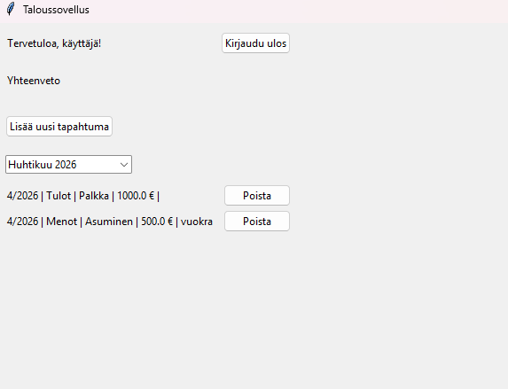
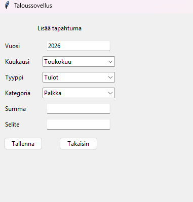

# Käyttöohje

Lataa projektin viimeisin [release](https://github.com/Jaqt/ot-harjoitustyo/releases).

## Ohjelman käynnistäminen

1. Asenna riippuvuudet komennolla:

```bash
poetry install
```

2. Luo tarvittavat ympäristömuuttujat (valinnainen):

Luo `.env` tiedosto tietokannan nimeämiseksi. Sovellus käyttää tarvittaessa oletus tiedostonimeä tietokannan luomiseksi.
```bash
DATABASE_FILENAME = "tähän sqlite3 tietokannan nimi"
```

3. Suorita vaadittavat tietokannan alustustoimenpiteet komennolla:

```bash
poetry run python src/init_db.py
```

4. Käynnistä sovellus komennolla:

```bash
poetry run invoke start
```

## Aloitusnäkymä

Sovellus käynnistyy aloitusnäkymään:



Sovelluksen käyttäjät ohjataan joko kirjautumaan tai rekistöimään uusi käyttäjä.

## Rekisteröinti

Uudet käyttäjät voivat rekisteröidä käyttäjän syöttämällä käyttäjätunnuksen ja salasanan. Käyttäjätunnuksen täytyy olla uniikki. Rekisteröinti viimeistellään painamalla `Rekisteröidy` painiketta. Takaisin aloitussivulle pääsee `Takaisin` painikkeella.



## Kirjautuminen

Rekisteröityneet käyttäjät voivat kirjautua sisään kirjautumisnäkymästä syöttämällä käyttäjätunnus ja salasana.



## Päänäkymä

Kirjautuneet käyttäjät ohjataan päänäkymään, josta näkyy viimeisimmän lisätyn kuukauden tapahtumat. 



Käyttäjän on tästä näkymästä mahdollista lisätä uusia tapahtumia sekä muokata ja poistaa vanhoja tapahtumia. Dropdown valikosta käyttäjä pystyy valitsemaan menneiden kuukausien tapahtumia näkyviin. Valikon vieressä on `Vie CSV` painike, jonka avulla kuukausijakson tapahtumat voi viedä CSV-tiedostoon. Tapahtumalistauksen oikealla puolella näkyy ympyräkaavio, jota voi vaihtaa yläpuolella olevan valikon kautta. Käyttäjät voivat myös kirjautua ulos oikeassa yläkulmassa olevaa `kirjaudu ulos` nappia painamalla.

## Uuden tapahtuman luominen

Uuden tapahtuman tiedot kirjoitetaan niihin varattuihin tekstikenttiin. `Vuosi` kenttään kirjoitetaan vuosiluku välillä 1900-2100, `Kuukausi`-valikosta voi valita oikean kuukauden. `Tyyppi`-valikosta voi vaihtaa luokkaa sen mukaan onko uusi tapahtuma meno tai tulo. `Kategoria`-valikosta valitaan tapahtuman kategoria. `Summa` kohtaan kirjoitetaan tapahtuman arvo käyttämällä pistettä desimaalierottimena. `Selite` kohta on vapaaehtoinen, johon voi kirjoittaa tapahtuman kuvauksen. Tapahtuma tallentuu `Tallenna` painiketta painamalla.


