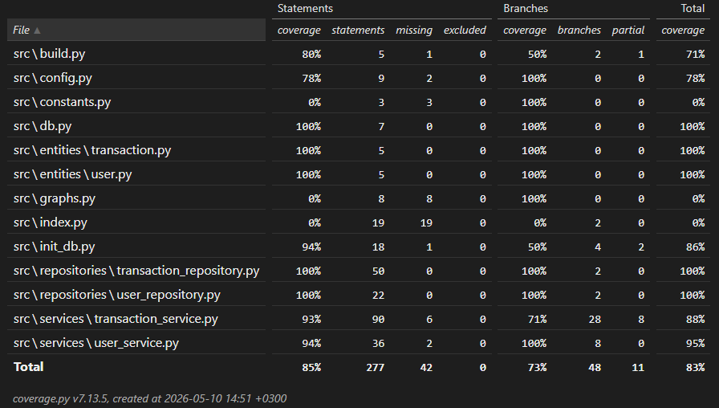

# Testausdokumentti

Ohjelmaa on testattu automatisoidusti yksikkö- ja integraatiotesteillä sekä manuaalisesti suoritetuilla järjestelmätason testeillä.

## Yksikkö- ja integraatiotestaus

Voit suorittaa testit komennolla:

```bash
poetry run invoke test
```

Voit generoida testikattavuusraportin komennolla:

```bash
poetry run invoke coverage-report
```

### Sovelluslogiikka

Sovelluslogiikasta vastaavia `UserService`- ja `TransactionService`-luokkia testataan testiluokilla `TestUserService` ja `TestTransactionService`.

`UserService`-luokan testeissä palvelu alustetaan siten, että sille injektoidaan käyttäjätietoja muistissa säilyttävä `FakeUserRepository` pysyväistallennusta käyttävän repositorion sijaan.

`TransactionService`-luokan testeissä palvelu alustetaan siten, että sille injektoidaan riippuvuuksiksi muistissa tietoa säilyttävä `FakeTransactionRepository` sekä kirjautunutta käyttäjää simuloiva `FakeUserService`. Näin sovelluslogiikan toimintaa voidaan testata ilman oikeaa tietokantaa.

### Repositorio-luokat

Repositorio-luokkia `UserRepository` ja `TransactionRepository` testataan erillistä testitietokantaa vasten. Testeissä käytettävä tietokanta on konfiguroitu `.env.test`-tiedoston avulla.

`UserRepository`-luokkaa testataan testiluokalla `TestUserRepository` ja `TransactionRepository`-luokkaa testiluokalla `TestTransactionRepository`.

### Testauskattavuus

Sovelluksen testien kokonaiskattavuus on 83%, haaraumakattavuus 73%. Käyttöliittymä on jätetty testauskattavuuden ulkopuolelle.



Testaamatta tai vähäisemmälle kattavuudelle ovat jääneet osa käynnistysskripteistä sekä apumoduulit, kuten `constants.py`.

## Järjestelmä- ja käyttöliittymätestaus

Käyttöliittymää ei ole testattu automatisoiduilla testeillä. Käyttöliittymän toiminta on testattu manuaalisesti järjestelmätestauksen yhteydessä.

### Asennus ja konfigurointi

Sovellus on asennettu ja käynnistetty käyttöohjeen mukaisesti sekä Windows- että Linux-ympäristössä. Testaus on suoritettu sekä `.env` tiedoston kanssa, että ilman sitä.

### Toiminnallisuudet

Sovelluksen määrittelydokumentin keskeiset toiminnallisuudet on käyty manuaalisesti läpi. Toiminnallisuuksia on testattu myös virheellisillä syötteillä.

## Sovellukseen jääneet laatuongelmat

Sovelluksessa on vielä joitakin käyttöliittymään ja virheidenkäsittelyyn liittyviä kehityskohteita.

- Käyttöliittymäkerrosta ei ole automatisoitu testeillä.
- Käynnistysskriptejä ei ole testattu kattavasti automatisoidusti.
- Sovellus ei anna järkevää virheilmoitusta, kun tietokantaa ei ole vielä alustettu.