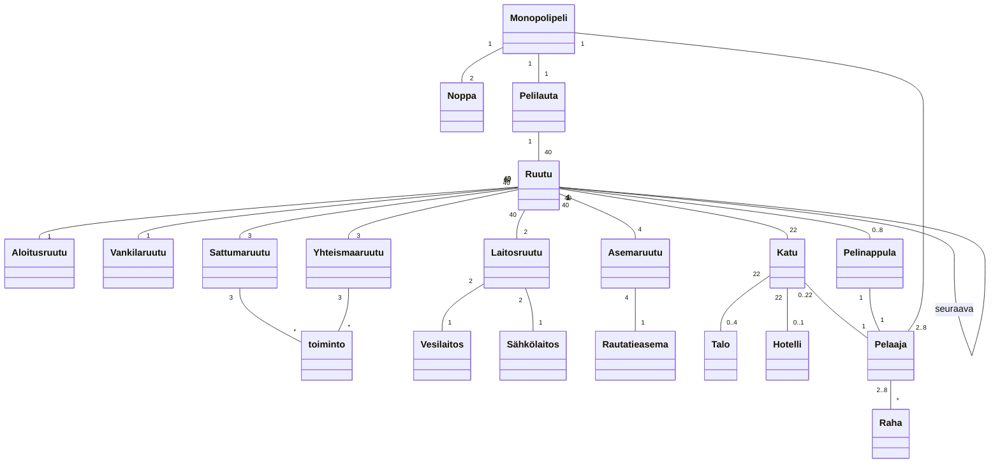

## Monopoli, alustava luokkakaavio

```mermaid
classDiagram
    Monopolipeli "1" -- "2" Noppa
    Monopolipeli "1" -- "1" Pelilauta
    Pelilauta "1" -- "40" Ruutu
    Ruutu "40" -- "1" Aloitusruutu
    Ruutu "40" -- "1" Vankilaruutu
    Ruutu "40" -- "3" Sattumaruutu
    Sattumaruutu "3" -- "*" toiminto
    Ruutu "40" -- "3" Yhteismaaruutu
    Yhteismaaruutu "3" -- "*" toiminto
    Ruutu "40" -- "2" Laitosruutu
    Laitosruutu "2" -- "1" Vesilaitos
    Laitosruutu "2" -- "1" Sähkölaitos
    Ruutu "40" -- "4" Asemaruutu
    Asemaruutu "4" -- "1" Rautatieasema
    Ruutu "40" -- "22" Katu
    Katu "22" -- "0..4" Talo
    Katu "22" -- "0..1" Hotelli
    Katu "0..22" -- "1" Pelaaja
    Ruutu "1" -- "1" Ruutu : seuraava
    Ruutu "1" -- "0..8" Pelinappula
    Pelinappula "1" -- "1" Pelaaja
    Pelaaja "2..8" -- "1" Monopolipeli
    Pelaaja "2..8" -- "*" Raha
```